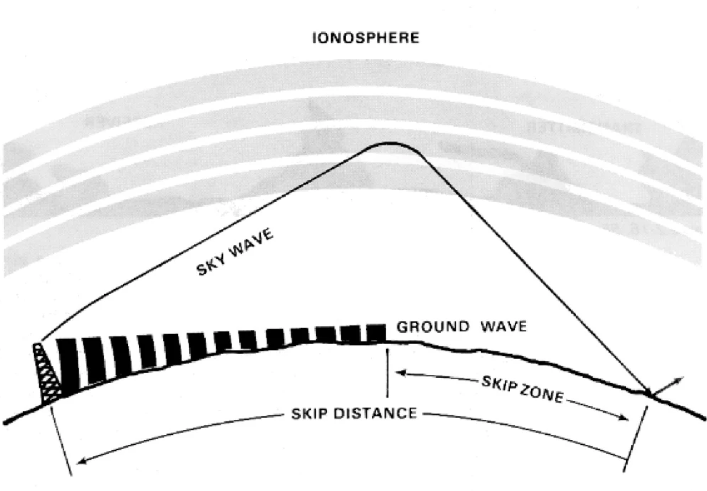

# Data analysis project: QSOs over HF bands
## Analyzing the effect of SFI on the likelihood of contacts occurring on various HF amateur bands

#### Context
In this project, I will be studying the effect of solar flux index (SFI) on the likelihood of a contact occuring on HF amateur bands between two locations (a source and a destination). SFI is a measurement of the amount of radio emissions at a wavelength of 10.7 cm (2.8 GHz) from the Sun, and it changes constantly based on solar activity. It is common knowledge in the HAM radio community that space weather has a profound effect on radio communication on HF bands, as solar radiation ionizes the ionosphere, which enables it to reflect/refract the radiowaves in the HF part of the spectrum back towards the ground instead of allowing them to escape into space. This phenomenon, commonly referred to as "skip", allows amateur radio enthusiasts to communicate beyond line of sight and even over great distances (DX), depending on the number of bounces the radiowave experiences. Radio amateurs often talk about "shooting skip", though this phenomenon isn't exclusive to the ham radio community. In fact, as any seasoned (and quite likely disillusioned) CB radio user can readily confirm, skip occurs on the CB band (11m) as well, which makes certain channels unusable at times due to the receiver inadvertently picking up transmissions from several hundreds of kilometers away... When two radio amateurs make contact over radio, they refer to it as a QSO - an abbreviation that will be used frequently in this project. 

#### Motivation

You might be wondering - why bother with this study? Well, while world maps showing favourable DX propagation conditions do exist (https://hf.dxview.org comes to mind), they all seem to rely (almost) exclusively on geomagnetic and solar activity data. One of the tools I will build in this project will use historical information about the number of QSOs occurring between two regions for a given SFI range to recommend the regions with which a QSO is most likely. This information is valuable to radio amateurs with directional antennas (like a Yagi antenna), as they need to adjust their antenna's orientation based on the country/location they are aiming to contact. The other tool will use the same historical information to recommend the band on which a QSO is most likely to occur. Wealthy amateurs with HF rigs capable of operating on several bands could benefit from this information to prioritize the most opportune bands when calling CQDX (ham lingo for attempting to make contact with a distant station). *Note to self: I aspire to be one of these wealthy amateurs someday...* 

No space weather maps were tortured in the making of these tools!

Pragmatism aside, the first half of this project deals with the more abstract question alluded to in the very beginning: how exactly does SFI affect the likelihood of a QSO occuring on HF bands? Answering this question will require using various data analysis techniques, mainly plotting, regression and scripting. In addition, I will define a useful measure referred to as "QSO count significance", which will be useful for studying the effects of SFI on QSO counts across bands and countries. This project also requires heaps and heaps of QSO data, which I will eagerly scrape from https://clublog.org/propagation.php. I could have just asked the guy (Michael Wells - G7VJR), but as Latarian Milton once said, "it's fun to do bad things". Besides, it's *not* a bad idea to showcase my proficiency with scraping techniques. The scraped data will be conveniently given the structure of a JSON tree for use throughout the project.  

The two tools described above, as well as an interactive QSO count significance vs SFI plotting tool, will be deployed using Dash. Please note that it is highly recommended to run the deployment script deployment.py inside Spyder, as you may otherwise encounter issues with matplotlib related to multi-threading.

All other details, insights, graphs and relevant code are available in the project's Jupyter notebook: QSO_study.ipynb .

*Quick note: scraping all the necessary data takes a very long time, so I will only consider contacts originating in Canada. However, my scraping script can easily handle any of the source countries listed in the dropdown menu on clublog.org.*

